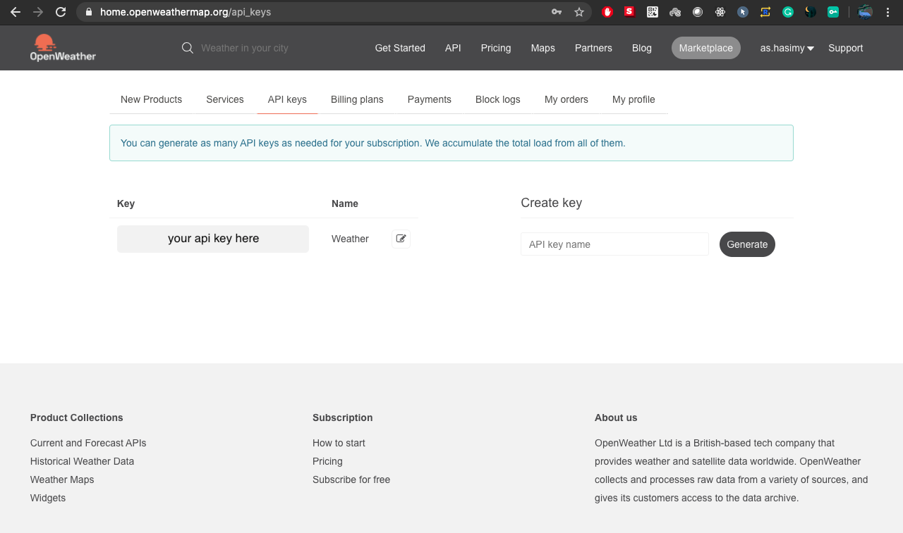

# Weathery
Check the temperature and weather of a city, with Node.js and OpenWeather API.

# OpenWeatherMap API

You need to have an OpenWeather account, which you can get one [here](https://openweathermap.org/register) 

Then, follow the instructions below to get your API key.

```sh
First, open the OpenWeatherMap dashboard. 

Second, go to the API keys segment in the dashboard.

Third, you can use the generated key situated like below.

```


# Usage

After that, you can install the app using the following instructions:

```sh
First, clone/download the repository.

Secondly, run this command in your CLI/Terminal to install the needed dependencies (npm install --save).

Third, inside index.js, change the API key.

Fourth, run the application!

```

## Licensed under the [MIT](https://raw.githubusercontent.com/hasimy-as/Weathery/master/LICENSE) License.

Happy coding!
~Hasimy
